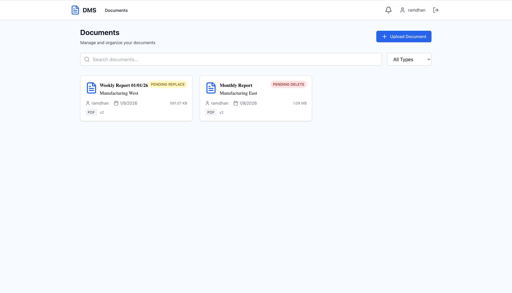
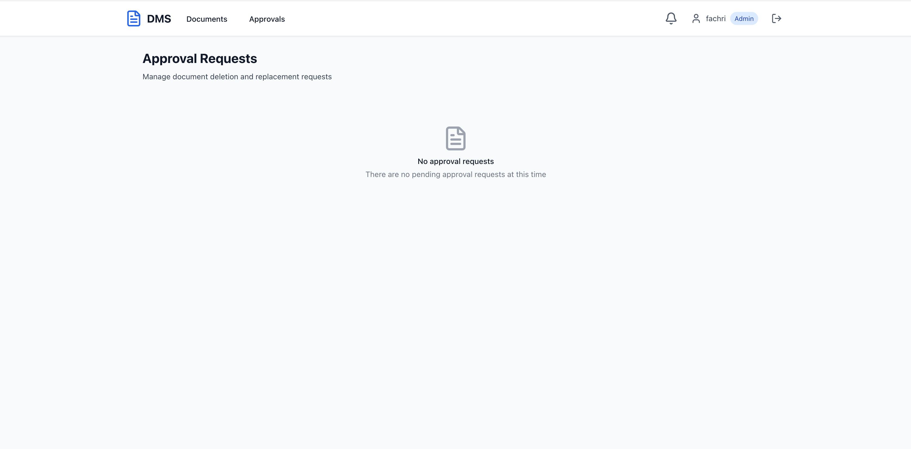
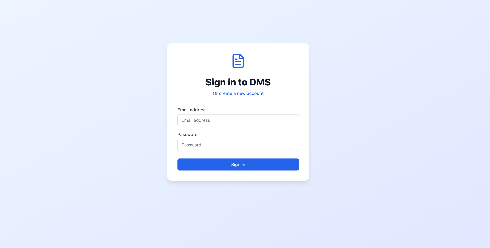
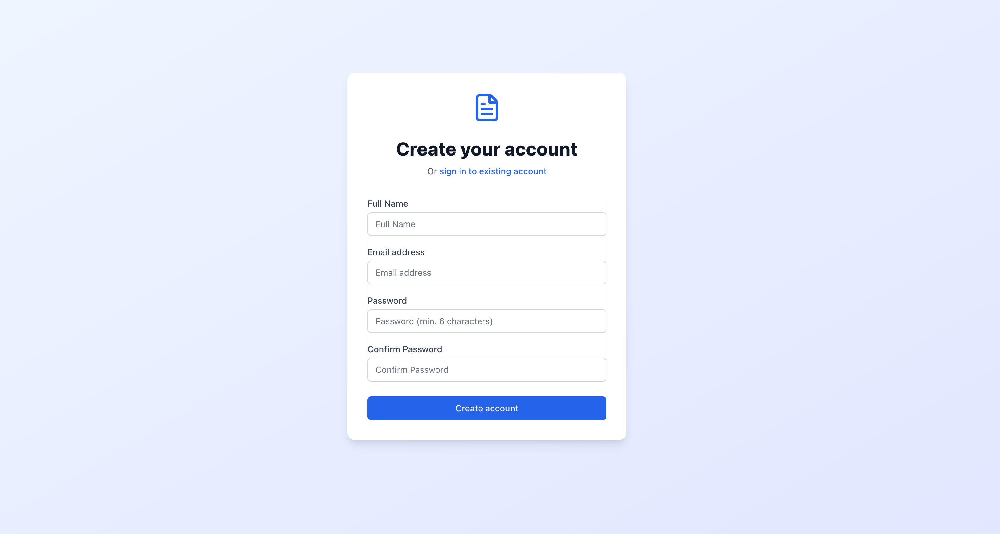
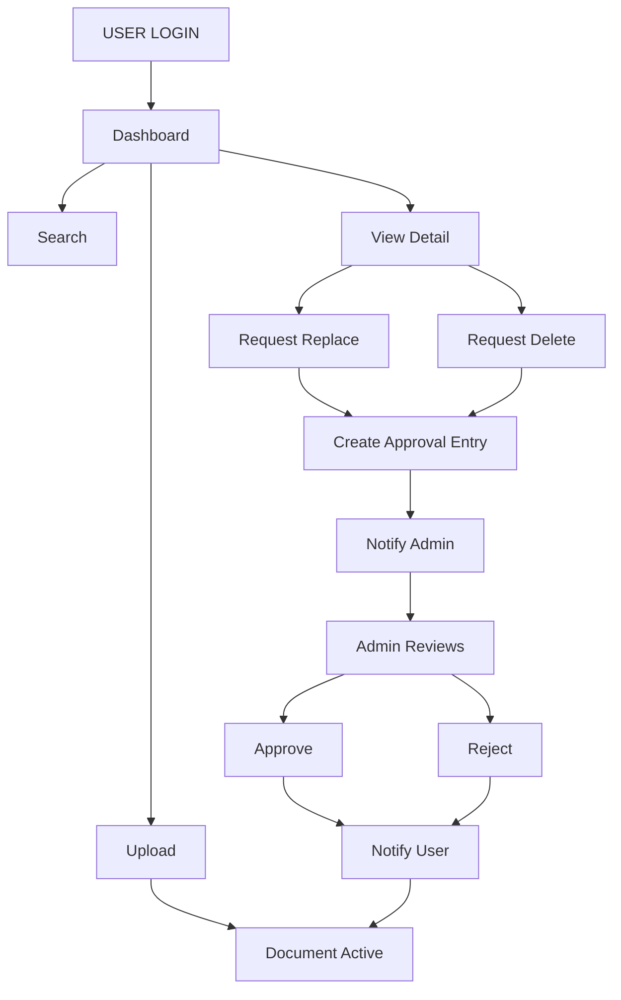

# 📘 Document Management System (DMS) with Approval Workflow

DMS adalah aplikasi pengelolaan dokumen berbasis web yang dirancang dengan fokus pada keamanan data dan integritas workflow. Sistem ini memastikan setiap tindakan kritis pada dokumen melalui proses verifikasi oleh Administrator.

---

> **Enterprise-ready Document Management System**  


## 🚀 Technology Stack

### 🧠 Backend
<p>
  
  
  
  
  
  
</p>

### 🎨 Frontend
<p>
  
  
  
  
</p>


---

## 📸 App Preview

|              User Dashboard               |         Admin Approval Console          |
| :---------------------------------------: | :-------------------------------------: |
|  |  |

|            Login Page             |              Register Page              |
| :-------------------------------: | :-------------------------------------: |
|  |  |
|     _Secure JWT-based login_      |         _New user registration_         |

---

## 🔄 System Flowchart

Visualisasi alur kerja dari sisi User hingga keputusan Admin:



## 🏗️ Project Structure

Proyek ini menggunakan **arsitektur monorepo** yang memisahkan Backend dan Frontend secara modular agar mudah dikembangkan dan diskalakan.

```text
dms-project/
├── backend/                # NestJS API (Enterprise Level)
│   ├── src/
│   │   ├── auth/           # Authentication & Security Guard
│   │   ├── users/          # User management
│   │   ├── documents/      # Core document management
│   │   ├── approvals/      # Workflow approval engine
│   │   ├── notifications/  # Real-time event notifications
│   │   ├── storage/        # Abstracted file storage service
│   │   ├── common/         # Shared utilities & interceptors
│   │   └── database/       # TypeORM configuration
│   └── uploads/            # Physical document storage
│
└── frontend/               # React + Vite (Modern UI)
    ├── src/
    │   ├── components/     # Reusable UI components
    │   ├── pages/          # View / Page modules
    │   ├── services/       # Axios API integrations
    │   ├── hooks/          # Custom business-logic hooks
    │   └── contexts/       # Global state (Auth & Theme)
```

---

## 🗄️ Database Schema

Struktur relasi tabel dirancang untuk mendukung **audit trail**, **workflow approval**, dan **sinkronisasi status dokumen**.

```text
USERS (Master Data)
├── id (UUID)
├── email (unique)
├── password (bcrypt)
├── fullName
└── role (USER / ADMIN)

DOCUMENTS (File Metadata)
├── id (UUID)
├── title
├── description
├── documentType
├── fileUrl
├── fileName
├── fileSize
├── version (Optimistic Lock)
├── status (ACTIVE / PENDING / DELETED)
└── createdBy (FK → USERS)

APPROVALS (Workflow Tracking)
├── id (UUID)
├── type (DELETE / REPLACE)
├── status (PENDING / APPROVED / REJECTED)
├── reason
├── adminComment
├── documentId (FK → DOCUMENTS)
├── requestedBy (FK → USERS)
└── reviewedBy (FK → USERS)

NOTIFICATIONS (Alert System)
├── id (UUID)
├── type
├── title
├── message
├── isRead
└── userId (FK → USERS)
```

---

## 🛠️ Installation & Setup

### 1️⃣ Database Setup

Buat database **MySQL** dengan nama:

```text
dms_project
```

Database dapat dibuat melalui **phpMyAdmin** atau **MySQL Client**. saya menggunakan MySQL MAMP

---

### 2️⃣ Backend Setup (NestJS)

Masuk ke folder backend, install dependency, lalu jalankan server:

```bash
cd backend
npm install
npm run start:dev
```

📌 **Catatan:**
Pastikan file `.env` sudah dikonfigurasi dengan benar:

- `DB_HOST`
- `DB_PORT`
- `DB_USER`
- `DB_PASS`
- `DB_NAME`

---

### 3️⃣ Frontend Setup (React + Vite)

Masuk ke folder frontend, install dependency, lalu jalankan aplikasi:

```bash
cd frontend
npm install
npm run dev
```

Frontend akan berjalan secara default di:

```text
http://localhost:5173
```

---

## 🚀 Key Technical Highlights

- **Optimistic Locking**
  Implementasi kolom `version` pada tabel `documents` untuk mencegah race condition saat update data.

- **Role-Based Access Control (RBAC)**
  Proteksi endpoint menggunakan **JWT Guard** berdasarkan peran **USER** dan **ADMIN**.

- **Approval Workflow Engine**
  Proses replace dan delete dokumen wajib melalui approval admin.

- **Real-time Notification (Polling Ready)**
  Sistem notifikasi berbasis polling (mudah dikembangkan ke WebSocket).

- **Security Best Practices**

  - Password hashing menggunakan **bcrypt**
  - UUID sebagai primary key untuk keamanan dan konsistensi data

---
