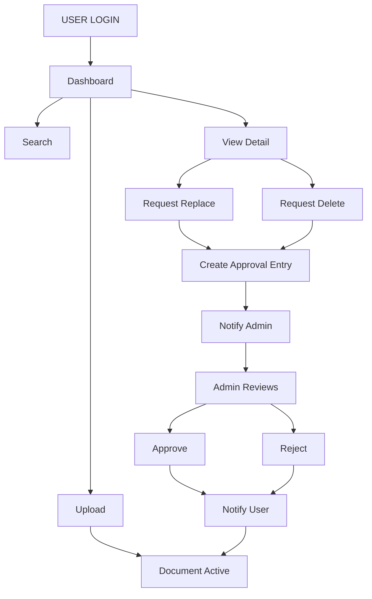

# 📘 Document Management System (DMS) with Approval Workflow

DMS adalah aplikasi pengelolaan dokumen berbasis web yang dirancang dengan fokus pada keamanan data dan integritas workflow. Sistem ini memastikan setiap tindakan kritis pada dokumen melalui proses verifikasi oleh Administrator.

---

## 📸 App Preview

|              User Dashboard               |         Admin Approval Console          |
| :---------------------------------------: | :-------------------------------------: |
|  |  |

|            Login Page             |              Register Page              |
| :-------------------------------: | :-------------------------------------: |
|  |  |
|     _Secure JWT-based login_      |         _New user registration_         |

---

## 🔄 System Flowchart

Visualisasi alur kerja dari sisi User hingga keputusan Admin:



## 🏗️ Project Structure

Proyek ini menggunakan arsitektur monorepo yang memisahkan Backend dan Frontend secara modular:

````text
dms-project/
├── backend/                # NestJS API (Enterprise Level)
│   ├── src/
│   │   ├── auth/           # Authentication & Security Guard
│   │   ├── users/          # User management
│   │   ├── documents/      # Core Document management
│   │   ├── approvals/      # Workflow approval engine
│   │   ├── notifications/  # Real-time event notifications
│   │   ├── storage/        # Abstracted File storage service
│   │   ├── common/         # Shared utilities & interceptors
│   │   └── database/       # TypeORM configuration
│   └── uploads/            # Document physical storage
└── frontend/               # React + Vite (Modern UI)
    ├── src/
    │   ├── components/     # Reusable UI components
    │   ├── pages/          # View/Page modules
    │   ├── services/       # Axios API integrations
    │   ├── hooks/          # Custom business logic hooks
    │   └── contexts/       # Global state (Auth & Theme)


## 🗄️ Database Schema
Struktur relasi tabel untuk mendukung audit trail dan sinkronisasi status:

```text
USERS (Master Data)
├── id (UUID)
├── email (unique)
├── password (Bcrypt)
├── fullName
└── role (USER/ADMIN)

DOCUMENTS (File Metadata)
├── id (UUID)
├── title | description | documentType
├── fileUrl | fileName | fileSize
├── version (Optimistic Lock)
├── status (ACTIVE/PENDING/DELETED)
└── createdBy (FK to USERS)

APPROVALS (Workflow Tracking)
├── id (UUID)
├── type (DELETE/REPLACE)
├── status (PENDING/APPROVED/REJECTED)
├── reason | adminComment
├── documentId (FK to DOCUMENTS)
├── requestedBy (FK to USERS)
└── reviewedBy (FK to USERS)

NOTIFICATIONS (Alert System)
├── id (UUID)
├── type | title | message | isRead
└── userId (FK to USERS)

## 🛠️ Installation & Setup
1. Database Setup
Buat database MySQL bernama dms_project melalui phpMyAdmin atau MySQL Client.
2. Backend Setup
Masuk ke folder backend, install dependency, dan jalankan server:
```text
cd backend
npm install
npm run start:dev
Catatan: Pastikan file .env sudah dikonfigurasi dengan DB_HOST, DB_USER, dan DB_PASS yang sesuai.

3. Frontend Setup
Masuk ke folder frontend, install dependency, dan jalankan aplikasi:
```text
cd frontend
npm install
npm run dev


## 🚀 Key Technical Highlights

1. Optimistic Locking: Implementasi kolom version pada dokumen untuk mencegah race condition.
2. Role-Based Access Control (RBAC): Proteksi endpoint menggunakan JWT Guard sesuai peran User/Admin.
3. Real-time Notification: Mekanisme polling (extensible to WebSocket) untuk update status approval.
4. Security: Hashing Bcrypt untuk kredensial dan UUID untuk identitas unik data.
````
